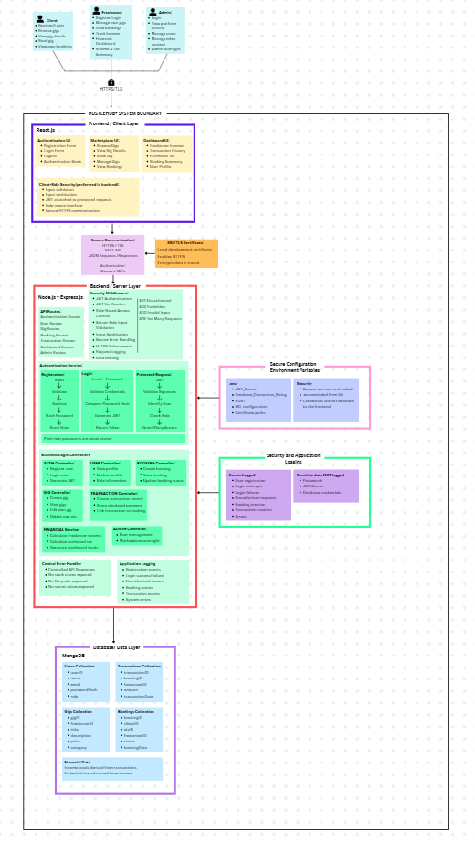

# 💼 HustleHub+

> **A Secure Freelance Marketplace Platform**

HustleHub+ is a secure freelance marketplace designed to connect **clients** looking for services with **freelancers** offering their skills and expertise.

The completed platform will allow freelancers to create and manage gigs, clients to browse and book services, and the system to generate simulated transaction records. Freelancers will also be able to track their income and view estimated tax obligations through a financial dashboard.

This repository currently contains **Part 1: Secure Foundations**, which focuses on establishing a secure Node.js and Express.js backend before the full marketplace functionality is introduced.

---

## 📑 Table of Contents

- [Project Overview](#-project-overview)
- [Intended Users](#-intended-users)
- [Part 1 Scope](#-part-1-scope)
- [Technology Stack](#-technology-stack)
- [System Architecture](#-system-architecture)
- [Backend Structure](#-backend-structure)
- [Security Features](#-security-features)
- [API Endpoints](#-api-endpoints)
- [Environment Configuration](#-environment-configuration)
- [Installation and Setup](#-installation-and-setup)
- [HTTPS Setup](#-https-setup)
- [Running the Application](#-running-the-application)
- [API Testing](#-api-testing)
- [Project Status](#-project-status)
- [Contributors](#-contributors)

---

## 📌 Project Overview

HustleHub+ is being developed using the **MERN stack**:

- **MongoDB** — persistent application data storage
- **Express.js** — backend API framework
- **React.js** — client-side user interface
- **Node.js** — backend runtime environment

The final application will provide a secure marketplace where clients and freelancers can interact through gigs and bookings. Simulated payments will generate transaction records, allowing freelancer income to be tracked and used to calculate estimated tax obligations.

### Part 1 – Secure Foundations

Part 1 focuses specifically on establishing the security foundation of the backend.

The current implementation provides:

- Secure user registration
- Secure user login
- Password hashing using bcrypt
- JWT-based authentication
- Protected API routes
- Input validation and normalisation
- HTTPS support using a local SSL certificate
- Centralised error handling
- Environment-based secret management
- Security headers using Helmet
- Restricted Cross-Origin Resource Sharing (CORS)
- JSON request payload limits
- In-memory user storage for development and testing

> **Note:** Part 1 uses an in-memory user store as permitted by the project requirements. MongoDB persistence and the complete marketplace functionality will be introduced during later development.

---

## 👥 Intended Users

HustleHub+ is designed around three main user roles.

### 👤 Clients

Clients use the marketplace to find and book services offered by freelancers.

The completed system will allow clients to:

- Register and securely log in
- Browse available gigs
- View gig information
- Book freelancer services
- View their bookings

### 💻 Freelancers

Freelancers use HustleHub+ to advertise services and manage their freelance activity.

The completed system will allow freelancers to:

- Register and securely log in
- Create and manage gigs
- View bookings associated with their services
- Track income from completed transactions
- View estimated tax obligations
- Access a financial dashboard

### 🛡️ Administrators

Administrators will provide platform-level oversight and management.

Administrative functionality will be introduced as the application develops.

---

## 🎯 Part 1 Scope

The purpose of Part 1 is to establish a secure backend foundation that later HustleHub+ functionality can build upon.

The current backend implements the following authentication flow:

```text
Registration
    ↓
Input Validation
    ↓
Password Hashing
    ↓
User Stored
    ↓
Login
    ↓
Credential Verification
    ↓
JWT Generated
    ↓
Authenticated Request
    ↓
JWT Verification
    ↓
Protected Resource
```

At this stage, the project focuses on authentication and backend security rather than implementing the complete marketplace.

---

## 🛠️ Technology Stack

| Technology | Purpose |
|---|---|
| **Node.js** | Backend JavaScript runtime |
| **Express.js** | REST API and routing |
| **bcrypt** | Secure password hashing and verification |
| **jsonwebtoken** | JWT generation and verification |
| **Helmet** | HTTP security headers and Content Security Policy |
| **CORS** | Controls permitted cross-origin API requests |
| **dotenv** | Environment variable management |
| **Node.js HTTPS** | HTTPS/TLS server support |
| **OpenSSL** | Generation of the local development SSL certificate |
| **Postman** | API endpoint and security testing |
| **MongoDB** | Planned persistent database for the complete MERN system |
| **React.js** | Planned frontend for the complete MERN system |

---

## 🏗️ System Architecture

HustleHub+ follows a secure MERN architecture.

The intended overall application flow is:

```text
Client / Freelancer / Admin
             │
             ▼
       React.js Frontend
             │
       HTTPS / REST API
             │
             ▼
     Node.js + Express.js
             │
       Security Controls
             │
             ▼
          MongoDB
```

For **Part 1**, development is concentrated on the Node.js and Express.js backend. User information is temporarily stored in memory rather than MongoDB.

### Architecture Diagram





The architecture diagram identifies the major MERN components, system boundaries, authentication flow, security controls, data flow and future marketplace components.

---

## 📂 Backend Structure

The backend follows a modular structure that separates routes, controllers, middleware, configuration and development certificates.

```text
api/
│
├── certs/
│   ├── generate-cert.sh
│   ├── localhost-cert.pem
│   └── localhost-key.pem
│
├── controllers/
│   └── authController.js
│
├── middleware/
│   ├── errorHandler.js
│   ├── protect.js
│   └── validateAuthInput.js
│
├── routes/
│   └── authRoutes.js
│
├── .env
├── .gitignore
├── index.js
├── package.json
└── package-lock.json
```

### Controllers

Controllers contain the main request-handling logic.

`authController.js` currently handles:

- User registration
- Password hashing
- User login
- Password verification
- JWT generation
- Retrieval of the authenticated user's profile

### Middleware

Middleware performs processing and security checks before or after requests reach the controllers.

The current middleware provides:

- Registration input validation
- Login input validation
- JWT verification
- Protection of authenticated routes
- Centralised error handling

### Routes

`authRoutes.js` defines the available authentication endpoints and connects them to the appropriate validation, authentication and controller functions.

### Server Entry Point

`index.js` configures and starts the Express application.

It is responsible for:

- Loading environment variables
- Configuring Helmet
- Configuring Content Security Policy
- Restricting CORS
- Limiting JSON request sizes
- Registering API routes
- Handling unknown routes
- Registering the central error handler
- Configuring HTTP or HTTPS
- Starting the server

---

## 🔐 Security Features

Security is treated as a core requirement of HustleHub+ because the completed system will process credentials, authentication information, transactions and financial information. (Please note full security breakdown is in pdf documentation attached, along with postman testing)

### Password Hashing

Passwords are hashed using **bcrypt** with a work factor of `12` before being stored.

Plain-text passwords are never intentionally stored in the user store or returned in API responses.

### JWT Authentication

Successful login generates a signed **JSON Web Token (JWT)** containing the authenticated user's ID and role.

Protected routes require the token using the following HTTP header:

```http
Authorization: Bearer <token>
```

The backend verifies the token before granting access to a protected resource.

### Input Validation

Authentication requests are validated before processing.

The backend currently checks:

- Required fields
- Input data types
- Email format
- Registration password length
- Email normalisation
- Leading and trailing whitespace

Invalid requests are rejected with controlled `400 Bad Request` responses.

### HTTPS

The backend supports **HTTPS/TLS** using Node.js HTTPS functionality.

A self-signed SSL certificate is used during local Part 1 development. HTTPS protects sensitive information such as passwords and authentication tokens while they are transmitted between the client and server.

### Secure Error Handling

A central error handler prevents unexpected server errors from exposing unnecessary internal application information to clients.

Generic responses are returned to the client while errors can be recorded server-side for debugging.

### Security Headers

**Helmet** is used to configure security-related HTTP response headers, including a Content Security Policy.

Express's `X-Powered-By` header is also disabled to reduce unnecessary technology disclosure.

### Restricted CORS

Cross-Origin Resource Sharing is restricted to the configured frontend origin rather than allowing unrestricted browser origins.

### Request Size Limiting

JSON request bodies are limited to:

```text
10kb
```

This prevents the authentication API from accepting unnecessarily large JSON payloads.

### Environment Variables

Sensitive configuration is separated from the application source code using environment variables.

This includes values such as:

- JWT signing secret
- JWT expiry
- HTTPS configuration
- SSL certificate paths
- Frontend origin
- Application port

For a more detailed explanation of these security decisions and their purpose, refer to the project security documentation.

---

## 🌐 API Endpoints

The current Part 1 API provides the following endpoints:

| Method | Endpoint | Authentication | Description |
|---|---|---|---|
| `GET` | `/` | No | Checks that the HustleHub+ API is running |
| `GET` | `/health` | No | Returns API health and protocol information |
| `POST` | `/api/auth/register` | No | Registers a new user |
| `POST` | `/api/auth/login` | No | Authenticates a user and returns a JWT |
| `GET` | `/api/auth/me` | **Yes** | Returns the authenticated user's profile |

---

## ⚙️ Environment Configuration

Create a `.env` file inside the backend/API directory.

Example configuration:

```env
APP_NAME=HustleHub+API

PORT=4000

JWT_SECRET=replace_with_a_secure_random_secret
JWT_EXPIRES_IN=1h

USE_HTTPS=true

SSL_KEY_PATH=./certs/localhost-key.pem
SSL_CERT_PATH=./certs/localhost-cert.pem

CLIENT_ORIGIN=http://localhost:5173
```

> ⚠️ **Important:** Never commit the real `.env` file, JWT secret or SSL private key to a public repository.

The following should be excluded using `.gitignore`:

```gitignore
node_modules/
.env
certs/*.pem
```

---

## 🚀 Installation and Setup

### 1. Clone the Repository

```bash
git clone <repository-url>
```

Move into the project directory:

```bash
cd <repository-name>
```

Then move into the backend/API directory if required:

```bash
cd api
```

### 2. Install Dependencies

Ensure that Node.js and npm are installed.

Then run:

```bash
npm install
```

This installs the dependencies defined in `package.json`.

### 3. Configure Environment Variables

Create the `.env` file and provide the required configuration values.

At minimum, ensure that a secure `JWT_SECRET` has been configured before testing authentication.

---

## 🔒 HTTPS Setup

HustleHub+ supports HTTPS during local development using a self-signed SSL certificate.

### 1. Navigate to the Certificate Directory

```bash
cd certs
```

### 2. Generate the Development Certificate

Run:

```bash
bash generate-cert.sh
```

The script uses OpenSSL to generate:

```text
localhost-key.pem
localhost-cert.pem
```

The files are used by the Node.js HTTPS server.

### 3. Enable HTTPS

Ensure the following value is present in `.env`:

```env
USE_HTTPS=true
```

The default certificate paths are:

```env
SSL_KEY_PATH=./certs/localhost-key.pem
SSL_CERT_PATH=./certs/localhost-cert.pem
```

> The certificate used in Part 1 is self-signed and intended for **local development only**. A production deployment should use a certificate issued by a trusted Certificate Authority (CA).

---

## ▶️ Running the Application

From the API directory, start the backend using the script configured in `package.json`.

For example:

```bash
npm start
```

If HTTPS is enabled successfully, the server will report:

```text
HTTPS server running on port 4000
```

The API can then be accessed locally using:

```text
https://localhost:4000
```

The health endpoint can be used to confirm the active protocol:

```text
https://localhost:4000/health
```

Example response:

```json
{
    "status": "OK",
    "protocol": "HTTPS"
}
```

---

## 🧪 API Testing

The Part 1 API can be tested using **Postman**.

### Register User

**Request**

```http
POST /api/auth/register
```

Example JSON body:

```json
{
    "fullName": "Test User",
    "email": "test@example.com",
    "password": "SecurePass123!"
}
```

A successful request should return:

```text
201 Created
```

---

### Login User

**Request**

```http
POST /api/auth/login
```

Example JSON body:

```json
{
    "email": "test@example.com",
    "password": "SecurePass123!"
}
```

A successful login returns a JWT that can be used to access protected endpoints.

---

### Access Protected Profile

**Request**

```http
GET /api/auth/me
```

Include the JWT in the request:

```http
Authorization: Bearer <token>
```

A valid token allows the authenticated user's profile to be returned.

A missing, invalid or expired token results in:

```text
401 Unauthorized
```

---

### Invalid Request Testing

The Postman collection should also demonstrate that the backend rejects invalid requests, including:

- Missing registration fields
- Invalid email addresses
- Passwords outside the permitted length
- Duplicate user registration
- Incorrect login credentials
- Missing authentication tokens
- Invalid JWTs
- Expired JWTs
- Requests to unknown routes

These tests demonstrate both successful API functionality and the behaviour of the implemented security controls.

> Because the development certificate is self-signed, Postman may require SSL certificate verification to be configured appropriately for local testing.

---

## 📊 HTTP Status Codes

The API uses appropriate HTTP status codes to communicate request results.

| Status | Meaning | Example |
|---|---|---|
| `200` | OK | Successful login or profile request |
| `201` | Created | Successful user registration |
| `400` | Bad Request | Invalid or missing input |
| `401` | Unauthorized | Missing, invalid or expired authentication |
| `404` | Not Found | Unknown route or unavailable user |
| `409` | Conflict | User already exists |
| `500` | Internal Server Error | Unexpected server-side error |

---

## 📈 Project Status

### ✅ Part 1 – Secure Foundations

Currently implemented:

- [x] Node.js and Express.js backend
- [x] User registration
- [x] User login
- [x] bcrypt password hashing
- [x] JWT generation
- [x] JWT verification middleware
- [x] Protected profile endpoint
- [x] Input validation and normalisation
- [x] Centralised error handling
- [x] HTTPS support
- [x] Local SSL certificate generation
- [x] Environment variable configuration
- [x] Helmet security headers
- [x] Content Security Policy
- [x] Restricted CORS
- [x] JSON payload size restriction

### 🔜 Future Development

The complete HustleHub+ application is intended to include:

- [ ] React.js frontend
- [ ] MongoDB persistent storage
- [ ] Client, Freelancer and Admin role-based access control
- [ ] Gig creation and management
- [ ] Gig browsing
- [ ] Booking functionality
- [ ] Simulated transactions
- [ ] Freelancer income tracking
- [ ] Estimated tax calculations
- [ ] Financial dashboard
- [ ] Backend and frontend containerisation
- [ ] Automated CI/CD pipeline
- [ ] Unit and API testing
- [ ] Automated security scanning

---

## 👨‍💻 Contributors

HustleHub+ is being developed as a group project.

| Team Member | Responsibility |
|---|---|
| **Nuha Grimwood ST10452224** | Backend / API Foundation |
| **Luis De Souza ST10307204** | Authentication / Security |
| **Unathi Mudzengi ST10453134** | Testing / Postman |
| **Megan/Max Harvey ST10438637** | Architecture / Documentation |

---

## 📚 Supporting Documentation

Additional project documentation includes:

- HustleHub+ Secure MERN Architecture Diagram
- Security Design Documentation
- Postman API Collection
- API Testing Screenshots
- Demonstration Video

---

<p align="center">
  <strong>HustleHub+</strong><br>
  Secure Foundations • MERN Architecture • Secure by Design
</p>
